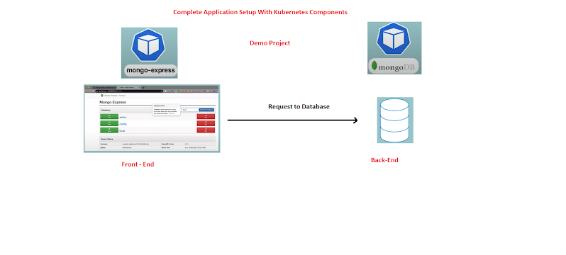
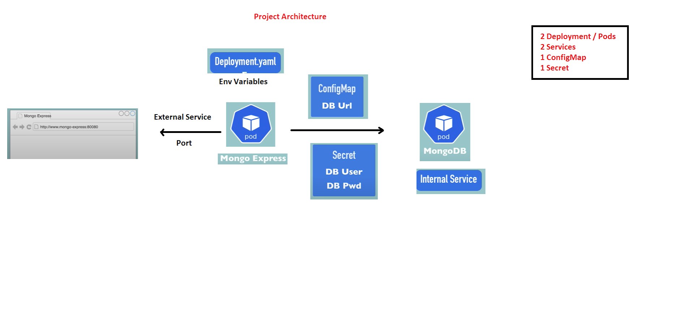
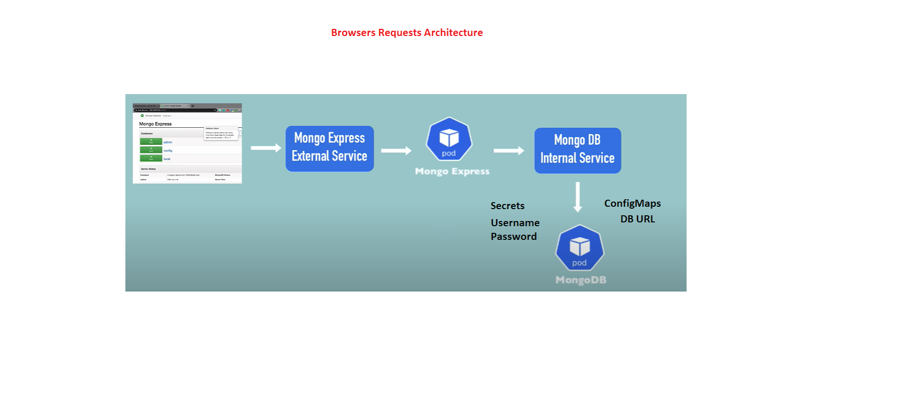

# MongoDB + Mongo Express on Kubernetes (with ConfigMaps & Secrets)

This project demonstrates deploying **MongoDB** and **Mongo Express** on **Kubernetes**,  
using **ConfigMaps** and **Secrets** to manage configuration and credentials.  

It shows how to:
- Run MongoDB as an internal database service.
- Expose Mongo Express as a web-based UI for MongoDB.
- Secure DB credentials using Kubernetes Secrets.
- Use ConfigMaps for connection URLs.

---

##  Architecture





---

##  Tech Stack
- **Kubernetes** (Deployments, Services, ConfigMap, Secret)
- **MongoDB** (Database Pod + Internal Service)
- **Mongo Express** (Admin UI + External Service)
- **ConfigMap** for DB URL
- **Secret** for DB username/password

---

##  Repository Layout
```
├── README.md
├── k8s/
│ ├── configmap.yml # ConfigMap with MongoDB URL
│ ├── secret.yml # Secret with DB credentials
│ ├── mongo-deployment.yml # MongoDB Deployment + ClusterIP Service
│ ├── express-deployment.yml # Mongo Express Deployment + NodePort Service
│ └── namespace.yml # (Optional) Dedicated namespace
└── .gitignore
```
